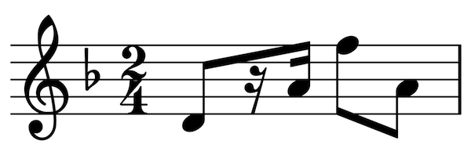
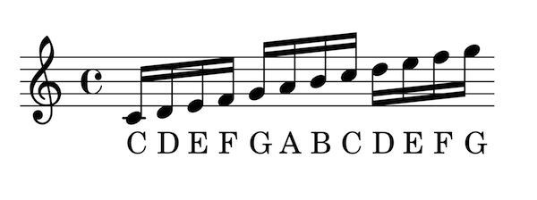
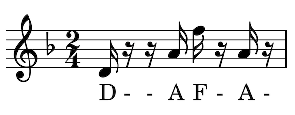

A.7 Bizet Beats

# Bizet Beats

After our brief excursion to the fantastic world of coding Minecraft
with Sonic Pi last month, let's get musical again. Today we're going to
bring a classical operatic dance piece straight into the 21st century
using the awesome power of code.

## Outrageous and Disruptive

Let's jump into a time machine back to the year 1875. A composer called
Bizet had just finished his latest opera Carmen.  Unfortunately like
many exciting and disruptive new pieces of music people initially
didn't like it at all because it was too outrageous and different. Sadly
Bizet died ten years before the opera gained huge international success
and became one of the most famous and frequently performed operas
of all time. In sympathy with this tragedy let's take one of the main
themes from Carmen and convert it to a modern format of music that is
also too outrageous and different for most people in our time - live
coded music!

## Decoding the Habanera

Trying to live code the whole opera would be a bit of a challenge for
this tutorial, so let's focus on one of the most famous parts - the bass
line to the Habanera:



This may look extremely unreadable to you if you haven't yet studied
music notation.  However, as programmers we see music notation as just
another form of code - only it represents instructions to a musician instead
of a computer. We therefore need to figure out a way of decoding it. 

## Notes

The notes are arranged from left to right like the words in this
magazine but also have different heights. *The height on the score
represents the pitch of the note.* The higher the note on the score, the
higher the pitch of the note.

In Sonic Pi we already know how to change the pitch of a note - we
either use high or low numbers such as `play 75` and `play 80` or we use
the note names: `play :E` and `play :F`. Luckily each of the vertical
positions of the musical score represents a specific note name. Take a
look at this handy look up table:



## Rests

Music scores are an extremely rich and expressive kind of code capable
of communicating many things. It therefore shouldn't come as much of a
surprise that musical scores can not only tell you what notes to play but
also when *not* to play notes. In programming this is pretty much
equivalent to the idea of `nil` or `null` - the absence of a value. In
other words not playing a note is like the absence of a note.

If you look closely at the score you'll see that it's actually a
combination of black dots with lines which represent notes to play and
squiggly things which represent the rests. Luckily Sonic Pi has a very
handy representation for a rest: `:r`, so if we run: `play :r` it
actually plays silence! We could also write `play :rest`, `play nil` or
`play false` which are all equivalent ways of representing rests.

## Rhythm

Finally, there's one last thing to learn how to decode in the notation -
the timings of the notes. In the original notation you'll see that the
notes are connected with thick lines called beams. The second note has
two of these beams which means it lasts for a 16th of a beat. The other
notes have a single beam which means they last for an 8th of a beat. The
rest has two squiggly beams which means it also represents a 16th of the
beat.

When we attempt to decode and explore new things a very handy trick is
to make everything as similar as possible to try and see any
relationships or patterns. For example, when we re-write our notation
purely in 16ths you can see that our notation just turns into a nice
sequence of notes and rests.



## Re-coding the Habanera

We're now in a position to start translating this bass line to Sonic
Pi. Let's encode these notes and rests in a ring:

```
(ring :d, :r, :r, :a, :f5, :r, :a, :r)
```
    
Let's see what this sounds like. Throw it in a live loop and tick
through it:

```
live_loop :habanera do
  play (ring :d, :r, :r, :a, :f5, :r, :a, :r).tick
  sleep 0.25
end
```
    
Fabulous, that instantly recognisable riff springs to life through your
speakers. It took a lot of effort to get here, but it was worth it -
high five!
    
## Moody Synths

Now we have the bass line, let's re-create some of the ambience of the
operatic scene. One synth to try out is `:blade` which is a moody 80s
style synth lead.  Let's try it with the starting note `:d` passed
through a slicer and reverb:

```
live_loop :habanera do
  use_synth :fm
  use_transpose -12
  play (ring :d, :r, :r, :a, :f5, :r, :a, :r).tick
  sleep 0.25
end

with_fx :reverb do
  live_loop :space_light do
    with_fx :slicer, phase: 0.25 do
      synth :blade, note: :d, release: 8, cutoff: 100, amp: 2
    end
    sleep 8
  end
end
```

Now, try the other notes in the bass line: `:a` and `:f5`. Remember, you
don't need to hit stop, just modify the code whilst the music is playing
and hit run again. Also, try different values for the slicer's `phase:`
opt such as `0.5`, `0.75` and `1`.

## Bringing it all together

Finally, let's combine all the ideas so far into a new remix of the
Habanera. You might notice that I've included another part of the bass
line as a comment. Once you've typed it all into a fresh buffer hit Run
to hear the composition. Now, without hitting stop, *uncomment* the
second line by removing the `#` and hit run again - how marvellous is
that! Now, start mashing it around yourself and have fun.

```
use_debug false
bizet_bass = (ring :d, :r, :r, :a, :f5, :r, :a, :r)
#bizet_bass = (ring :d, :r, :r, :Bb, :g5, :r, :Bb, :r)
 
with_fx :reverb, room: 1, mix: 0.3 do
  live_loop :bizet do
    with_fx :slicer, phase: 0.125 do
      synth :blade, note: :d4, release: 8,
        cutoff: 100, amp: 1.5
    end
    16.times do
      tick
      play bizet_bass.look, release: 0.1
      play bizet_bass.look - 12, release: 0.3
      sleep 0.125
    end
  end
end
 
live_loop :ind do
  sample :loop_industrial, beat_stretch: 1,
    cutoff: 100, rate: 1
  sleep 1
end
 
live_loop :drums do
  sample :bd_haus, cutoff: 110
  synth :beep, note: 49, attack: 0,
    release: 0.1
  sleep 0.5
end
```
